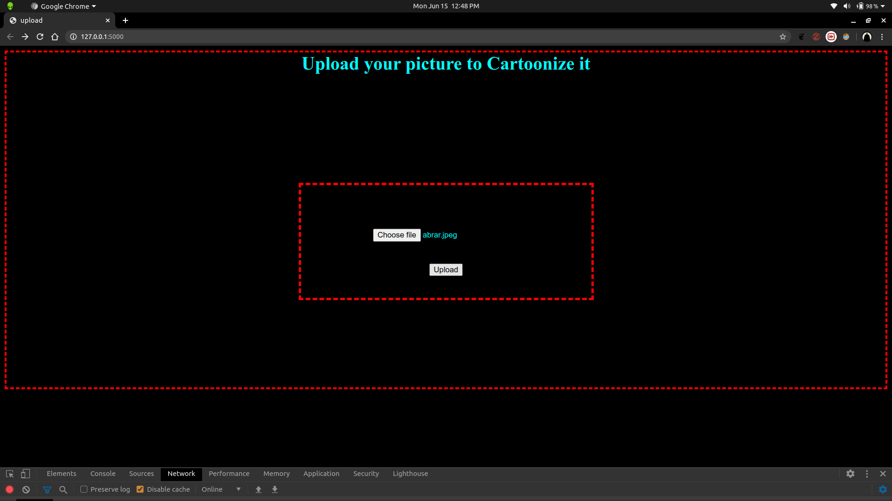
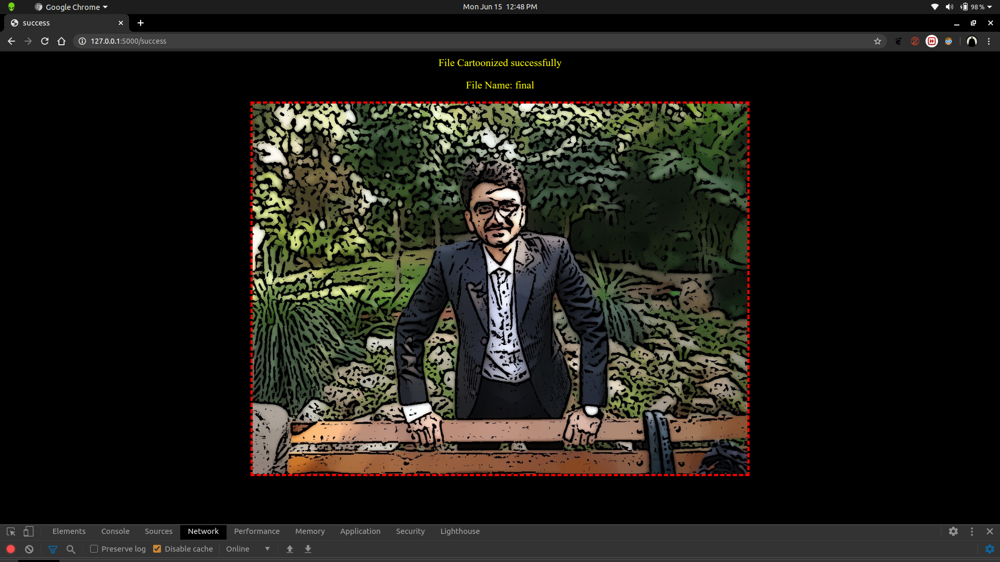
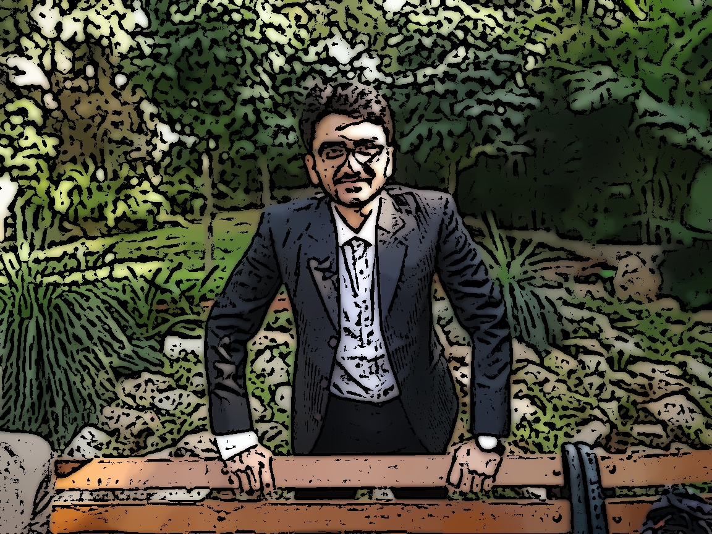

# Cartoonizer

## Created a Cartoonizer App using OpenCV and deployed using FLASK

Disable chrome cache from ChromeDevTools
* press Ctrl+Shift+I
* under Network tab
* check 'Disable Cache'

---------------------------------------------------------------------------.

# Select the image 

---------------------------------------------------------------------------------------------------------------------------------------

# Image selected

---------------------------------------------------------------------------------------------------------------------------------------

# Image is CARTOONIZED

----------------------------------------------------------------------------------------------------------------------------------------

# You Have just been CARTOONIZED ! 

---------------------------------------------------------------------------

