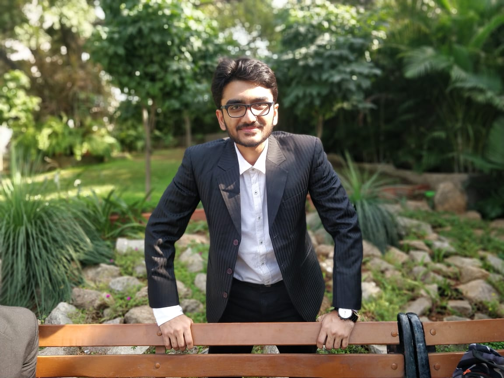

# Cartoonizer

## Cartoonizer App using OpenCV and deployed using FLASK

Disable chrome cache from ChromeDevTools
* press Ctrl+Shift+I
* under Network tab
* check 'Disable Cache'

# How does it work ?
1. Apply a bilateral filter to reduce the color palette of the image.
2. Convert the original color image into grayscale.
3. Apply a median blur to reduce image noise.
4. Use adaptive thresholding to detect and emphasize the edges in an edge mask.
5. Combine the color image from step 1 with the edge mask from step 4.

--------------------------------------------------------------------------

# Select the image 

---------------------------------------------------------------------------------------------------------------------------------------

# Image selected

---------------------------------------------------------------------------------------------------------------------------------------

# Image is CARTOONIZED

----------------------------------------------------------------------------------------------------------------------------------------

# You Have just been CARTOONIZED ! 

---------------------------------------------------------------------------

